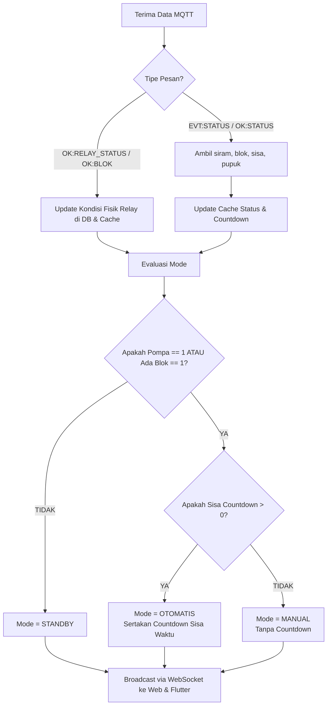
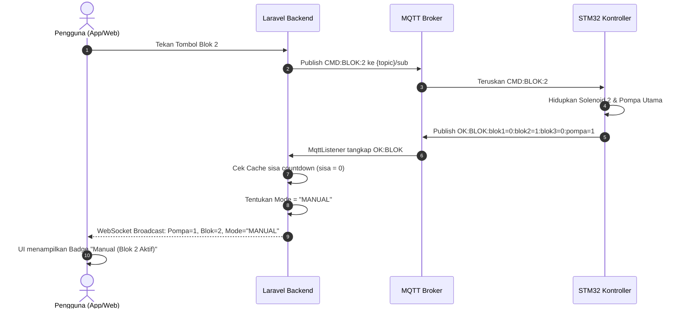
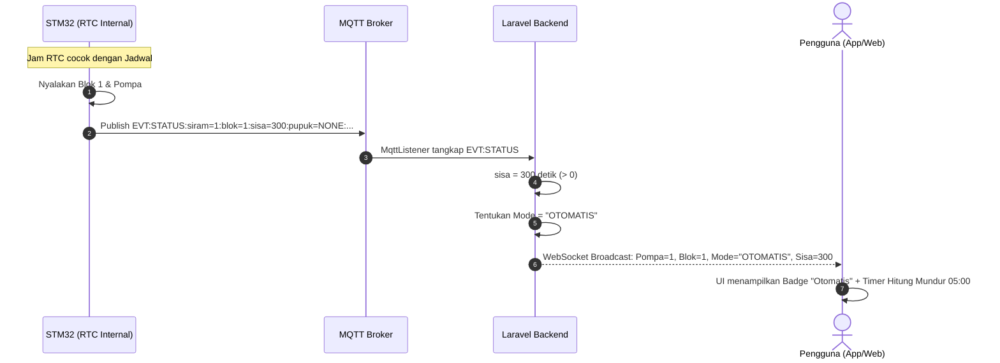

# 📋 Spesifikasi Protokol Komunikasi & Manajemen Status Relay Smart Farm (STM32 IoT)

Dokumen ini menjelaskan spesifikasi protokol MQTT antara **STM32 (Kontroller Hardware)**, **ESP32 (Gateway/WiFi)**, **Laravel Backend (Server)**, dan **Klien (Web & Mobile Flutter)** untuk fitur **Pemilihan Blok**, **Kontrol Relay**, **Status Relay**, serta **Logika Penentuan Status Operasi (Otomatis vs. Manual vs. Standby)**.

---

## 📑 Daftar Isi
1. [Arsitektur Komunikasi](#1-arsitektur-komunikasi)
2. [Format Perintah & Respon MQTT](#2-format-perintah--respon-mqtt)
   - [A. Set Blok Irigasi (`CMD:BLOK`)](#a-set-blok-irigasi-cmdblok)
   - [B. Kontrol Relay Individual (`CMD:RELAY`)](#b-kontrol-relay-individual-cmdrelay)
   - [C. Cek Status Relay (`CMD:RELAY_STATUS`)](#c-cek-status-relay-cmdrelay_status)
   - [D. Event Otomatis (`EVT:AUTO_OFF`)](#d-event-otomatis-evtauto_off)
   - [E. Telemetri Status Berkala (`EVT:STATUS` / `OK:STATUS`)](#e-telemetri-status-berkala-evtstatus--okstatus)
3. [Konsep & Logika Penentuan Mode Operasional](#3-konsep--logika-penentuan-mode-operasional)
   - [Prinsip Dasar](#prinsip-dasar)
   - [Matriks Keputusan (Decision Matrix)](#matriks-keputusan-decision-matrix)
4. [Diagram Alur (Flowchart & Sequence Diagram)](#4-diagram-alur)
5. [Struktur Data Backend & Broadcast WebSocket](#5-struktur-data-backend--broadcast-websocket)
6. [Rencana Implementasi Teknis](#6-rencana-implementasi-teknis)

---

## 1. Arsitektur Komunikasi

```
+--------------------------+                 +------------------------+
|  Flutter App / Web App   |                 |   Laravel Backend      |
|  (UI Klien & Kontrol)    |<--- WebSocket --|   - MqttListener       |
|                          |     Reverb/WS   |   - SmartFarmService   |
+--------------------------+                 +------------------------+
            |                                             |
     REST API / HTTP                                      | MQTT Client
            |                                             |
            v                                             v
+---------------------------------------------------------------------+
|                          MQTT BROKER                                |
|  Topic Sub: {topic}/sub  (Server -> ESP32 -> STM32)                 |
|  Topic Pub: {topic}/pub  (STM32 -> ESP32 -> Server)                 |
+---------------------------------------------------------------------+
                                   |
                             UART / Serial
                                   v
+------------------------+                 +------------------------+
|     ESP32 Gateway      |<-- Serial UART -|    STM32 Microcontroller|
|   (Konektivitas WiFi)  |                 |  (Relay, Pompa, Sensor)|
+------------------------+                 +------------------------+
```

---

## 2. Format Perintah & Respon MQTT

Semua pesan menggunakan teks satu baris berformat delimiter titik dua (`:`).

### A. Set Blok Irigasi (`CMD:BLOK`)
Digunakan untuk mengaktifkan salah satu blok penyiraman (zona) atau mematikan seluruh blok secara simultan.

| Arah | Format Pesan | Keterangan |
| :--- | :--- | :--- |
| **App/Server ➔ Device** | `CMD:BLOK:<nomor_blok>` | `<nomor_blok>`: `1`, `2`, `3`, atau `0` (Matikan semua) |
| **Device ➔ Server/App** | `OK:BLOK:blok1=<0\|1>:blok2=<0\|1>:blok3=<0\|1>:pompa=<0\|1>` | Konfirmasi status blok dan pompa utama |

#### Aturan & Perilaku:
1. **Pilih Blok (1, 2, atau 3)**:
   - Kontroller STM32 akan menyalakan katup solenoid blok yang dipilih (`blokX = 1`).
   - Katup blok lain otomatis dimatikan (`blokY = 0`).
   - Pompa utama otomatis dihidupkan (`pompa = 1`) untuk mengalirkan air ke blok tersebut.
   - **Contoh Request**: `CMD:BLOK:2`
   - **Contoh Response**: `OK:BLOK:blok1=0:blok2=1:blok3=0:pompa=1`

2. **Matikan Semua Blok (0)**:
   - Mengirim `CMD:BLOK:0` akan mematikan semua katup blok (`blok1=0:blok2=0:blok3=0`) dan mematikan pompa utama (`pompa=0`).
   - Jika pompa pupuk sedang aktif, sistem hardware akan mematikan pupuk terlebih dahulu (mengirim event `EVT:AUTO_OFF:PUPUK:blok_habis`) demi keamanan jaringan pipa.
   - **Contoh Request**: `CMD:BLOK:0`
   - **Contoh Response**:
     ```text
     EVT:AUTO_OFF:PUPUK:blok_habis
     OK:BLOK:blok1=0:blok2=0:blok3=0:pompa=0
     ```

---

### B. Kontrol Relay Individual (`CMD:RELAY`)
Digunakan untuk mengontrol relay tertentu secara independen (misalnya injektor pupuk atau testing relay).

| Arah | Format Pesan | Keterangan |
| :--- | :--- | :--- |
| **App/Server ➔ Device** | `CMD:RELAY:<coil_id>:<state>` | `<coil_id>`: 0-4, `<state>`: `1` (ON) atau `0` (OFF) |
| **Device ➔ Server/App** | `OK:RELAY:<coil_id>:<state>` | Konfirmasi perubahan status relay |
| **Device ➔ Server/App (Error)** | `ERR:<KODE_ERROR>` | Contoh: `ERR:PUPUK_TANPA_POMPA`, `ERR:PUPUK_TANPA_BLOK` |

#### Pemetaan ID Coil Relay:
| Coil ID | Nama Hardware | Nama Database (`output_name`) | Deskripsi |
| :---: | :--- | :--- | :--- |
| `0` | Pompa Utama | `sf_pompa` | Pompa pendorong sirkulasi utama |
| `1` | Solenoid Blok 1 | `sf_blok1` | Katup irigasi Zona 1 |
| `2` | Solenoid Blok 2 | `sf_blok2` | Katup irigasi Zona 2 |
| `3` | Solenoid Blok 3 | `sf_blok3` | Katup irigasi Zona 3 |
| `4` | Pompa Pupuk | `sf_pupuk` | Injektor nutrisi / pupuk cair |

> **Safety Interlock Hardware**:
> - Pupuk (`Coil 4`) **hanya boleh menyala jika Pompa Utama ON dan minimal 1 Blok aktif**.
> - Jika syarat tidak terpenuhi, STM32 akan menolak dan merespon `ERR:PUPUK_TANPA_POMPA` atau `ERR:PUPUK_TANPA_BLOK`.

---

### C. Cek Status Relay (`CMD:RELAY_STATUS`)
Perintah untuk meminta status fisik terkini dari semua relay (Ground Truth) tanpa menunggu jadwal berkala.

| Arah | Format Pesan | Keterangan |
| :--- | :--- | :--- |
| **App/Server ➔ Device** | `CMD:RELAY_STATUS` | Permintaan status aktual seluruh relay |
| **Device ➔ Server/App** | `OK:RELAY_STATUS:blok1=%d:blok2=%d:blok3=%d:pompa=%d:pupuk=%d` | Status fisik setiap relay (`0` = OFF, `1` = ON) |
| **Alternatif Balasan** | `OK:BLOK:blok1=%d:blok2=%d:blok3=%d:pompa=%d` | Variasi balasan ringkas blok & pompa |

#### Contoh Pertukaran:
- **Kirim**: `CMD:RELAY_STATUS`
- **Balasan (Semua OFF)**:
  `OK:RELAY_STATUS:blok1=0:blok2=0:blok3=0:pompa=0:pupuk=0`
- **Balasan (Blok 2 & Pupuk Aktif)**:
  `OK:RELAY_STATUS:blok1=0:blok2=1:blok3=0:pompa=1:pupuk=1`

---

### D. Event Otomatis (`EVT:AUTO_OFF`)
Event yang dikirim oleh STM32 ketika relay dimatikan secara otomatis oleh logika proteksi internal microcontroller.

| Format Event | Pemicu (Trigger) | Tindakan Sistem |
| :--- | :--- | :--- |
| `EVT:AUTO_OFF:PUPUK:blok_habis` | Blok dimatikan (`CMD:BLOK:0`) saat pupuk masih menyala | Backend mengubah status `sf_pupuk` ke `0` di cache & database |
| `EVT:AUTO_OFF:PUPUK:target_selesai`| Dosis pupuk yang dijadwalkan telah tercapai | Backend memperbarui pupuk ke `NONE`/`0` |
| `EVT:AUTO_OFF:POMPA:timer_habis` | Durasi waktu penyiraman selesai | Backend mematikan pompa dan blok |

---

### E. Telemetri Status Berkala (`EVT:STATUS` / `OK:STATUS`)
Dikirim STM32 secara periodik (heartbeat) atau sebagai balasan dari `CMD:STATUS`.

```text
EVT:STATUS:siram=<0|1>:blok=<no>:sisa=<detik>:pupuk=<NONE|TUNGGU|ON>:jam=<hhmm>:hari=<0-6>:error=<0|1>
```

| Parameter | Tipe | Deskripsi |
| :--- | :---: | :--- |
| `siram` | `int` | `1` = Proses penyiraman sedang berjalan, `0` = Tidak menyiram |
| `blok` | `int` | Nomor blok yang aktif (`1`, `2`, `3`, atau `0` jika tidak ada) |
| `sisa` | `int` | **Countdown hitung mundur sisa waktu penyiraman (dalam detik)** |
| `pupuk` | `string` | Status siklus pupuk: `NONE` (mati), `TUNGGU` (pre-irrigation), `ON` (injeksi aktif) |
| `jam` | `string` | Jam waktu RTC alat saat ini (format `HHMM`) |
| `hari` | `int` | Hari saat ini (`0`=Minggu, `1`=Senin, ..., `6`=Sabtu) |
| `error` | `int` | `0` = Normal, `1` = Terjadi kendala / relay error |

---

## 3. Konsep & Logika Penentuan Mode Operasional

Pengguna memerlukan kejelasan status di dashboard: **apakah alat sedang menyiram otomatis sesuai jadwal, sedang dinyalakan manual oleh seseorang, atau sedang standby**.

### Prinsip Dasar:
1. **Kondisi Fisik Hardware (Pompa & Relay)**:
   - Kondisi aktual (menyala/mati) selalu mengacu pada **Status Relay** (`OK:RELAY_STATUS` atau `OK:BLOK`).
   - Jika `pompa == 1`, berarti air sedang mengalir secara fisik.

2. **Keterangan Mode (Otomatis vs. Manual)**:
   - **OTOMATIS**: Terdeteksi jika terdapat **countdown aktif (`sisa > 0`)** pada payload telemetri `EVT:STATUS`. Countdown menunjukkan bahwa STM32 sedang menghitung mundur durasi jadwal yang diprogram.
   - **MANUAL**: Terdeteksi jika pompa atau salah satu blok menyala (`pompa == 1` atau `blokX == 1`), tetapi **TIDAK ADA countdown** (`sisa == 0` atau tidak ada timer jadwal yang berjalan).
   - **STANDBY**: Jika pompa mati (`pompa == 0`) dan semua blok mati (`blok1=0, blok2=0, blok3=0`).

---

### Matriks Keputusan (Decision Matrix)

| Pompa (`pompa`) | Blok Aktif (`blok`) | Countdown (`sisa`) | Status Mode Operasi | Label Badge UI | Aksi / Keterangan Tampilan |
| :---: | :---: | :---: | :---: | :---: | :--- |
| `1` | `1`, `2`, atau `3` | **> 0** | **OTOMATIS** | 🟢 **Otomatis (Jadwal)** | Menampilkan blok aktif + hitung mundur: *Contoh: "Blok 2 - Sisa 04:32"* |
| `1` | `1`, `2`, atau `3` | **0** | **MANUAL** | 🔵 **Manual (Aktif)** | Menampilkan blok aktif tanpa countdown: *Contoh: "Blok 1 (Manual)"* |
| `1` | `0` | - | **MANUAL (PUMP ONLY)** | 🟡 **Pompa Manual** | Pompa menyala tanpa blok (warning: potensi tekanan balik) |
| `0` | `0` | `0` | **STANDBY** | ⚪ **Standby (Siaga)** | Sistem siaga menunggu jadwal berikutnya |
| `0` | `0` | - (Error=1) | **ERROR** | 🔴 **Hardware Error** | Tombol *Reset Error* ditampilkan di UI |

---

## 4. Diagram Alur

### A. Alur Penentuan Mode di Backend & UI


### B. Sequence Diagram: Skenario Kontrol Manual


### C. Sequence Diagram: Skenario Penyiraman Otomatis (Jadwal)


---

## 5. Struktur Data Backend & Broadcast WebSocket

Payload JSON yang dibroadcast oleh Laravel (`App\Events\DeviceStatusUpdated`) ke channel private Web & Flutter:

```json
{
  "device_id": 20,
  "outputs": [
    {"name": "sf_pompa", "value": 1},
    {"name": "sf_blok1", "value": 0},
    {"name": "sf_blok2", "value": 1},
    {"name": "sf_blok3", "value": 0},
    {"name": "sf_pupuk", "value": 0}
  ],
  "smart_farm": {
    "mode": "MANUAL",               // "OTOMATIS" | "MANUAL" | "STANDBY"
    "mode_label": "Manual (Aktif)", // Label ramah pengguna
    "active_blok": 2,               // Blok yang sedang menyala
    "pompa": 1,                     // Kondisi pompa (1=ON, 0=OFF)
    "pupuk": "NONE",                // "NONE" | "TUNGGU" | "ON"
    "countdown_seconds": 0,         // Sisa detik (0 jika manual/standby)
    "countdown_formatted": "00:00", // mm:ss
    "error_code": 0,
    "last_sync": "2026-09-13T05:45:00Z"
  }
}
```

---

## 6. Rencana Implementasi Teknis

### 1. Backend Laravel
- **`app/Services/MqttSmartFarmService.php`**:
  - Tambahkan method `sendRelayStatus(string $mqttTopic): bool` untuk mengirim `CMD:RELAY_STATUS`.
- **`app/Console/Commands/MqttListener.php`**:
  - Tambahkan parser untuk `OK:RELAY_STATUS` (mengurai `blok1`, `blok2`, `blok3`, `pompa`, `pupuk`).
  - Perbarui generator status Smart Farm agar mengevaluasi field `mode`:
    ```php
    $isAnyOutputOn = ($pompa == 1) || ($blok1 == 1 || $blok2 == 1 || $blok3 == 1);
    $hasCountdown  = ($sisaSeconds > 0);

    if ($isAnyOutputOn && $hasCountdown) {
        $mode = 'OTOMATIS';
    } elseif ($isAnyOutputOn && !$hasCountdown) {
        $mode = 'MANUAL';
    } else {
        $mode = 'STANDBY';
    }
    ```

### 2. Frontend Web Dashboard
- Menampilkan pill badge dinamis pada card kontrol:
  - 🟢 Hijau: `Otomatis (Jadwal)` + Widget Timer
  - 🔵 Biru: `Manual (Pengguna)`
  - ⚪ Abu-abu: `Standby`
- Tombol quick action untuk refresh status relay via `CMD:RELAY_STATUS`.

### 3. Aplikasi Mobile Flutter (`swaratani_mobile`)
- Pada `device_detail_screen.dart`:
  - Gunakan `smart_farm.mode` untuk menentukan tampilan header kontrol irigasi.
  - Sembunyikan timer countdown jika mode adalah `MANUAL` atau `STANDBY`.
  - Tampilkan countdown animasi jika mode adalah `OTOMATIS`.
